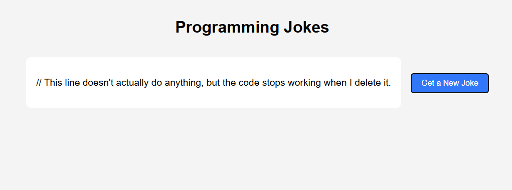

# Programming Jokes App

A React application that fetches and displays programming jokes using the JokeAPI. The application automatically loads a joke when the page first renders and allows users to fetch a new joke by clicking a button.

## Features

- Fetches a programming joke when the application loads
- Displays a loading message while waiting for the API response
- Allows users to fetch a new joke with a button click
- Uses React Hooks (`useState` and `useEffect`)
- Handles API errors gracefully

## Technologies Used

- React
- Vite
- JavaScript
- JokeAPI

## Screenshot



## Installation

1. Clone the repository:

```bash
git clone <repository-url>
```

2. Navigate to the project directory:

```bash
cd <project-folder>
```

3. Install dependencies:

```bash
npm install
```

## Usage

Start the development server:

```bash
npm run dev
```

Open your browser and navigate to the local URL displayed in the terminal (typically `http://localhost:5173`).

When the application loads, a programming joke will automatically be fetched and displayed. Click the **Get a New Joke** button to retrieve another joke from the API.

## Running Tests

```bash
npm run test
```

## API Endpoint

The application retrieves jokes from:

```text
https://v2.jokeapi.dev/joke/Programming?type=single
```

## Project Structure

```text
src/
├── App.jsx
├── components/
│   ├── JokeDisplay.jsx
│   └── FetchButton.jsx
└── __tests__/
    └── App.test.jsx
```

## Author

Created by Matthew Swanberg as part of a React Hooks lab assignment course 5 mod 1.